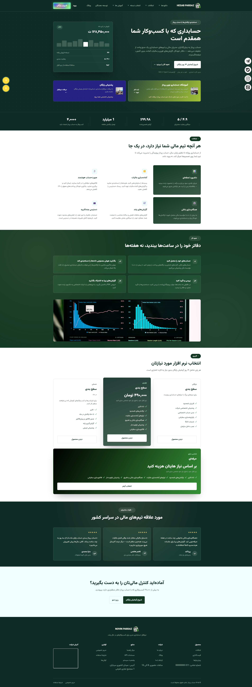
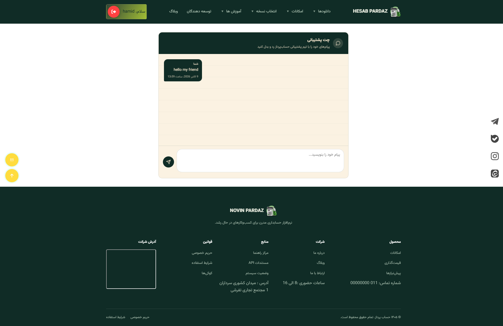
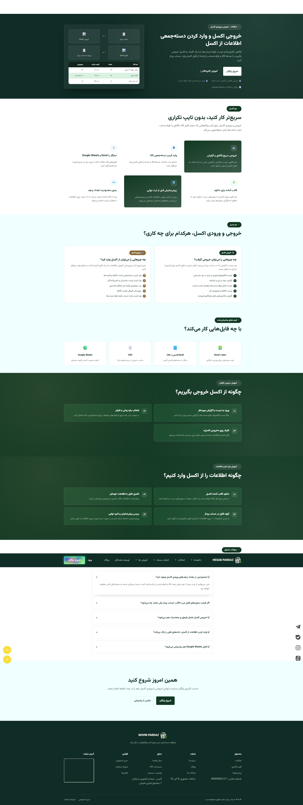
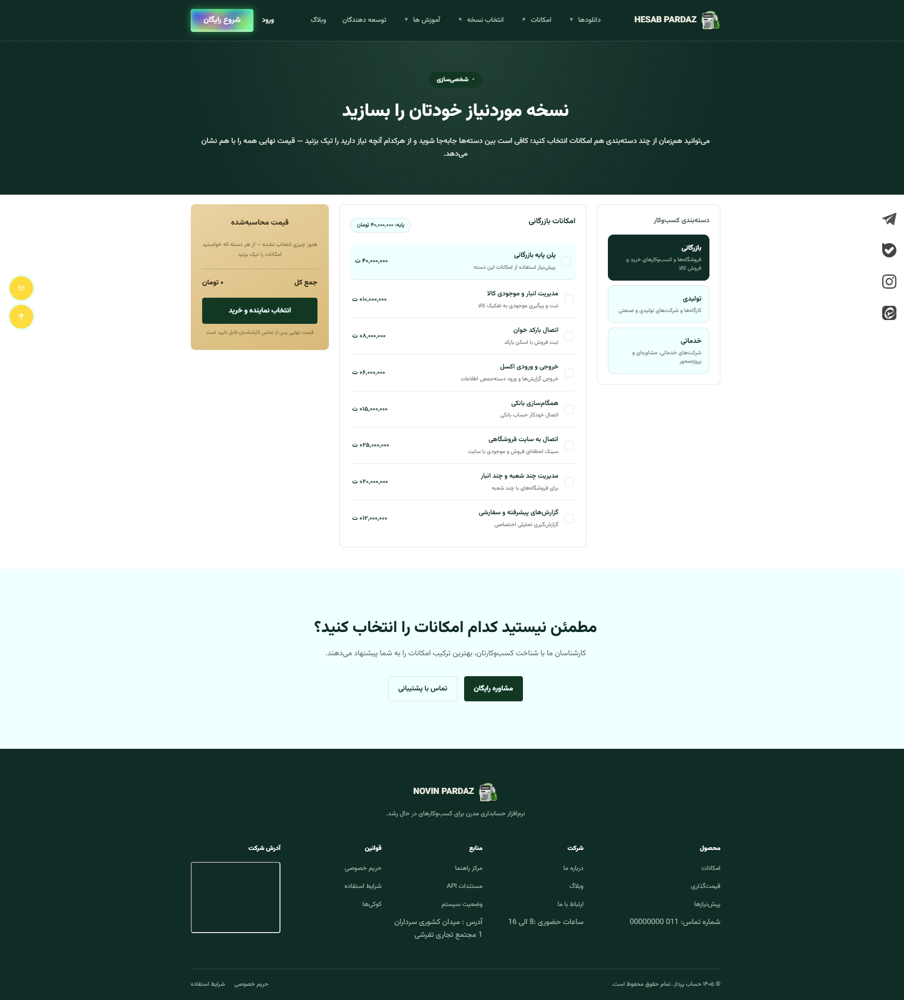
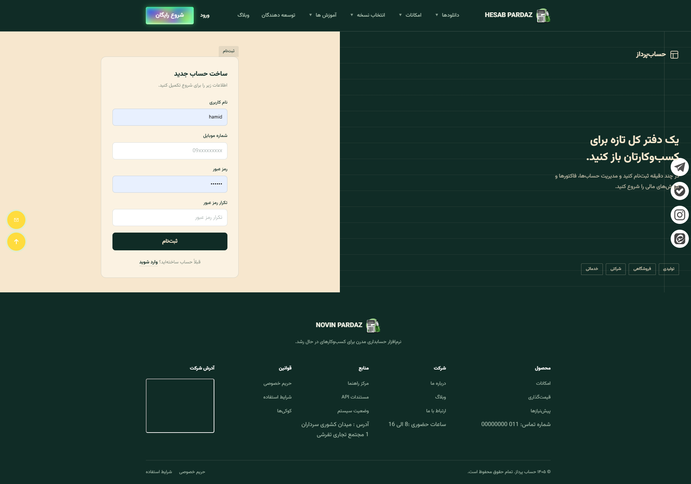

# HESAB PARDAZ – Green Theme Style

A complete, responsive, multi-page website with a clean green-themed design, built with **Django**, **HTML**, **CSS**, and **JavaScript**.

The platform combines accounting software services, company and service presentation, an online store, a blog, and an accounting training academy in one website.

## Features

- **User accounts:** registration, login, and a personal user panel
- **Dashboard & reports:** an overview of user data and reports
- **Dedicated chat page:** a private chat page for communication with the support team
- **Demo request:** users can request a demo of the software
- **Software customization:** users can choose and customize the software they want
- **Instant pricing:** the cost of the selected software is displayed live as options change
- **Contact form:** a simple way for visitors to get in touch
- **Accounting academy:** pages for accounting training courses
- **Online store & blog:** product pages and content/articles
- **Fully responsive:** works well on desktop, tablet, and mobile

## Tech Stack

| Layer | Technology |
|---|---|
| Backend | Python, Django |
| Frontend | HTML5, CSS3, JavaScript |

## Getting Started

### Prerequisites

- Python 3.9 or newer
- pip
- Git

### Installation

```bash
# 1. Clone the repository
git clone https://github.com/USERNAME/REPO-NAME.git
cd REPO-NAME

# 2. Create and activate a virtual environment
python -m venv venv

# Windows
venv\Scripts\activate
# macOS / Linux
source venv/bin/activate

# 3. Install dependencies
pip install -r requirements.txt

# 4. Apply database migrations
python manage.py migrate

# 5. (Optional) Create an admin user
python manage.py createsuperuser

# 6. Run the development server
python manage.py runserver
```

Then open **http://127.0.0.1:8000/** in your browser.

## Project Structure

```
REPO-NAME/
├── manage.py
├── requirements.txt
├── <project_name>/      # Django settings and URLs
├── <app_name>/          # Django app(s)
├── templates/           # HTML templates
├── static/              # CSS, JavaScript, images
└── README.md
```

> Adjust the folder names to match your actual project.

## Screenshots

 Add screenshots here, for example:
 
 .png)
 
 
 
 


## Customization

- **Colors:** change the green theme colors in the main CSS file inside `static/`.
- **Pages:** edit or add templates in the `templates/` folder.
- **Settings:** update site configuration in `settings.py`.

## Contributing

Contributions, issues, and feature requests are welcome. Feel free to open an issue or submit a pull request.

## License

This project is licensed under the terms of the license in the [LICENSE](LICENSE) file.
